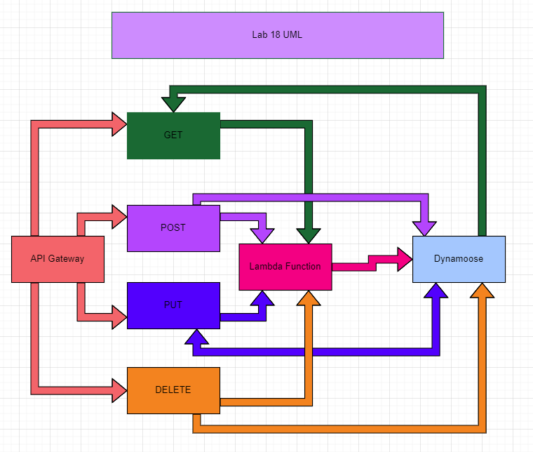

# serverless-api

In our Serverless API, we are creating a few things that will all be run from RESTful API's. Once our RESTful API triggers, we will make a request to our serverless API. Then our lambda function will run which will connect us to our database to store our data in our tables we made in Dynamoose.

## DynamoDB

We use DynamoDB we use tables that store our data in them. They work off of our schema to create our database.

## API Gateway

Here we create our RESTful API's which include not limited too, GET, POST, PUT, and DELETE. We can create the pathway for our API's and even set parameters or deeper layers in our API all in AWS API Gateway.

## UML

## Questions

- What is the root URL to your API?
  - arn:aws:execute-api:us-west-2:850427120219:8mxpme0xz3/*/GET/people
- What are the routes?
  - people
- What inputs do they require?
  - name
- What output do they return?
  - id and name

## Contributors

- Ayrat Gimranov
- Mark Thanadabouth
- Tom McGuire
